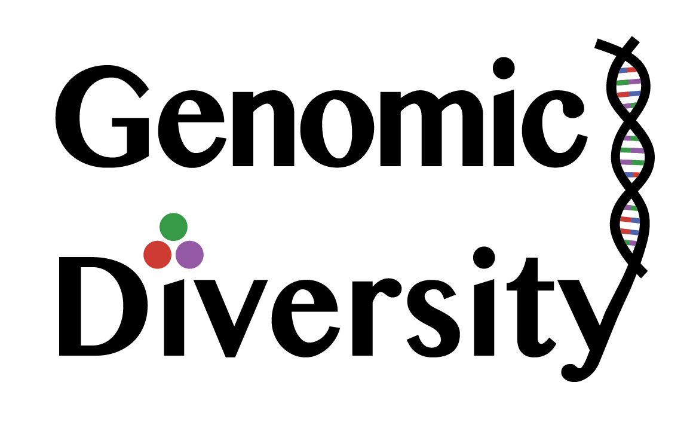

# GenomicDiversity

[](https://github.com/darreni/GenomicDiversity.jl/actions/workflows/CI.yml?query=branch%3Amain)

[](https://darreni.github.io/GenomicDiversity.jl/dev)



## Description

GenomicDiversity is a Julia package for the analysis of genomic variation within and among multiple populations. 
Using input data that is a matrix of biallelic genotypes, with individuals in rows and loci in columns, 
GenomicDiversity can calculate per-locus and windowed within-group diversity, 
between group genetic distance, and relative differentiation between populations.
It can produce plots that illustrate various aspects of genomic diversity.

## Citation

If you use GenomicDiversity.jl, please cite this paper which will be the first to formally mention this package:

Irwin, D., S. Bensch, C. Charlebois, G. David, A. Geraldes, S.K. Gupta, B. Harr, P. Holt, J.H. Irwin, V.V. Ivanitskii, I.M. Marova, Y. Niu, S. Seneviratne, A. Singh, Y. Wu, S. Zhang, T.D. Price. 2024. The distribution and dispersal of large haploblocks in a superspecies. Preprint (not yet peer-reviewed) on _Authorea_: [https://doi.org/10.22541/au.173114974.42895933/v1](https://doi.org/10.22541/au.173114974.42895933/v1)

## Disclaimer

The functions in this package were developed by [Darren Irwin](https://www.zoology.ubc.ca/~irwin/irwinlab/) over a number of years, for use in various analyses. 
They are now mature enough that I think it is an appropriate time to make them available as a Julia package. However, I am certain they could be improved in various ways. My intent is to revise and update this package over time, and I welcome feedback and suggestions regarding how to best do so.

## Example analysis using GenomicDiversity.jl

The example here will be based on a dataset from this paper:

McCallum, Q., K. Askelson, F.F. Fogarty, L. Natola, E. Nikelski, A. Huang, and D. Irwin. 2024. Pronounced differentiation on the Z chromosome and parts of the autosomes in crowned sparrows contrasts with mitochondrial paraphyly: implications for speciation. _Journal of Evolutionary Biology_, voae004, [https://doi.org/10.1093/jeb/voae004](https://doi.org/10.1093/jeb/voae004)

We will load in a large dataset of genotypes throughout the genomes of Golden-crowned Sparrows and two forms of White-crowned Sparrows: _pugetensis_ and _gambelii_. 
The data files are within the folder `demoData/SparrowDemo_data_McCallumetal2024/` of the GenomicDiversity.jl repository.

These input files were produced by an analysis pipeline that took genotyping-by-sequencing (GBS) reads, 
mapped them to a reference genome, identified single nucleotide polymorphisms (SNPs), called genotypes of individuals,
and outputted the information in three files: 
* a genotype file containing a matrix of genotypes (rows representing individuals and columns representing loci), where 0 represents homozygous reference, 1 represents heterozygous, 2 represents homozygous alternate, and -1 represents missing data
* a `.indv` file containing individual identifiers (corresponding to rows of the genotype matrix)
* a `.pos` file providing the locations of loci in the genome (with rows representing loci, column 1 indicating the scaffold, and column 2 indicating the position along that scaffold)

Using the GenomicDiversity package, we can load the information in the above three files into a single data structure called a `GenoData`. (We also have the option of keeping the data in three distinct data structures--the package is flexible in that way.)

First, we'll do some setup (loading packages and filenames):

```julia
# load required packages 
import Pkg
Pkg.add("GenomicDiversity")
Pkg.add("MultivariateStats")
Pkg.add("CairoMakie")
Pkg.add("DataFrames")
Pkg.add("CSV")
Pkg.add("DelimitedFiles")
Pkg.add("Impute")
# Note: ou only need to do the above once per Julia environment
using GenomicDiversity, MultivariateStats, CairoMakie, DataFrames, CSV, DelimitedFiles, Impute

# set data file names--make sure these are appropriate to your computer and file names
pathName = "demoData/SparrowDemo_data_McCallumetal2024/"
metadataFile = pathName * "SparrowDemo.Fst_groups.txt"
genotypesFile = pathName * "SparrowDemo_genotypes.012"
individualsFile = genotypesFile * ".indv"
positionsFile = genotypesFile * ".pos"
```

Now we load the data into a `GenoData` object:

```julia
sparrowGenoData = GenomicDiversity.loadGenoData(metadataFile, individualsFile, genotypesFile, positionsFile)
# look at the genotype matrix:
sparrowGenoData.genotypes
```

By examining the size of the matrix, we can see that the data matrix includes 47 individuals and 45,986 loci. 

We choose the groups to include in our analysis, and the colors to represent them. 
These names refer to entries in the `Fst_group` column of the metadata file. 

```julia
groups_to_plot = ["GCSP","PSWS","GWCS"]

groupColorKey = Dict("GCSP" => "gold",
                    "PSWS" => "red",
                    "GWCS" => "blue")

groupColors = [groupColorKey[i] for i in groupsToPlot]
```

### PCA

If we want to use Principal Components Analysis (PCA) to visualize a good 2-dimensional representation
of genomic relationships among individuals, we first need to impute missing genotypes.
The function below will modify the type of matrix so that missing values are represented by `missing` rather than `-1`, 
and then it imputes numerical values for the missing data:

```julia
sparrowGenoDataImputed = GenomicDiversity.imputeMissingGenoData(sparrowGenoData)
```

Now we are ready to call the `GenomicDiversity.plotPCA()` function to do the PCA and make the plot:

```julia
PCAmodel = GenomicDiversity.plotPCA(sparrowGenoDataImputed,
        groupsToPlot, groupColors;
        sampleSet="Zonotrichia sparrows", regionText="whole_genome",
        flip1=false, flip2=false, showPlot=true)
PCAmodel.PCAfig  # shows the figure
```

The resulting plot:


The above shows genomic variation illustrated in 2 dimensions, showing Golden-crowned sparrows in yellow, _pugetensis_ White-crowned Sparrows in red, and _gambelii_ White-crowned Sparrows in blue.

### Genotype-by-individual plot of highly differentiated SNPs

Our overall dataset has close to 46,000 SNPs, far too many to visualize meaningfully in a single plot.
We can come up with a meaningful subset by examining variation on a single scaffold (i.e., chromosome in this case)
and only showing the SNPs that strongly differ in allele frequency between chosen groups.

We'll calculate allele frequencies and sample sizes for each group, 
and then genetic differentiation (known as F<sub>ST</sub>) between the groups:

```julia
freqs, sampleSizes = GenomicDiversity.getFreqsAndSampleSizes(sparrowGenoDataImputed, groupsToPlot)

Fst, FstNumerator, FstDenominator, pairwiseNamesFst = GenomicDiversity.getFst(freqs, sampleSizes, groupsToPlot)
```

Now we will choose a scaffold and specify some other parameters for the plotting algorithm:

```julia
chr = "CM018231.2" # the name of a scaffold in the reference genome
regionInfo = chooseChrRegion(sparrowGenoData, chr) # this gets the maximum position for the chromosome
group1 = "GCSP"   # the alleles most common in this  group will be assigned the same color in the graph
groupsToCompare = "GCSP_PSWS" # The groups to compare for the Fst filter below
Fst_cutoff =  0.8
missingFractionAllowed = 0.2
```

Finally, we can actually make the plot:

```julia
plotInfo = plotGenotypeByIndividualWithFst(sparrowGenoDataImputed, groupsToCompare, 
    Fst_cutoff, missingFractionAllowed, 
    regionInfo, Fst, pairwiseNamesFst, 
    freqs, groupsToPlot, groupColors)
plotInfo[1] # this outputs the plot
```

The resulting plot:


The above shows genotypic variation among _Zonotrichia_ sparrows along a single chromosome. Each row represents an individual, with leftmost and rightmost colors indicating  Golden-crowned sparrows in yellow, _pugetensis_ White-crowned Sparrows in red, and _gambelii_ White-crowned Sparrows in blue. Dark purple and light purple boxes represent homozygotes for alternate loci, and boxes with triangles represent heterozygotes. Missing data is indicated by a horizontal line. Only highly differentiated (F<sub>ST</sub> > 0.8) loci are shown.

## Filtering of individuals and loci

The GenomicDiversity package contains several functions for filtering `GenoData` objects. These are written in a flexible way to allow for filtering out (the default) or in according to criteria set up by the user:

### filtering individuals

An example in which we filter *out* the Golden-crowned Sparrows in our data set:

```julia
sparrowGenoData_noGCSP = filterInds(sparrowGenoData, sparrowGenoData.indInfo.Fst_group .== "GCSP")
```

Alternatively, filter *in* the Golden-crowned Sparrows (filtering out all the others):

```julia
sparrowGenoData_noGCSP = filterInds(sparrowGenoData, sparrowGenoData.indInfo.Fst_group .== "GCSP"; direction = "in")
```

A related function can be used to filter *out* based on names of individuals

```julia
sparrowGenoData_filtered = filterNamedInds(sparrowGenoData, ["sp_ocwa_plate1_GCSP002", "sp_ocwa_plate1_GCSP004"])
```

Or filter those *in* instead:

```julia
sparrowGenoData_filtered = filterNamedInds(sparrowGenoData, ["sp_ocwa_plate1_GCSP002", "sp_ocwa_plate1_GCSP004"]; direction = "in")
```

### filtering loci

This works in a similar way as above, but with loci rather than individuals. First, an example of filtering in based on some criteria, in this case removing the loci on a particular scaffold:

```julia
lociSelection = (sparrowGenoData.positions.chrom .== "CM018230.2")
sparrowGenoData_LociFiltered = filterLoci(sparrowGenoData, lociSelection)
```

Or, include those loci on that particular scaffold:

```julia
sparrowGenoData_LociFiltered = filterLoci(sparrowGenoData, lociSelection; direction = "in")
```


## Documentation

Descriptions of all functions in the GenomicDiversity can be found [here](https://darreni.github.io/GenomicDiversity.jl/dev/).